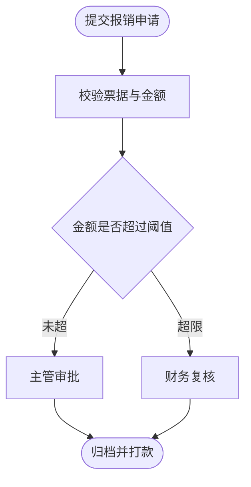

# 审批流程说明

本文档描述一个简化的两级审批流程，并附流程图。

## 业务背景

员工提交报销申请后，系统先做金额与票据的自动校验；
金额在校验范围内则进入主管审批，否则升级至财务复核。

## 流程图

```mermaid
flowchart TD
    A([提交报销申请]) --> B[校验票据与金额]
    B --> C{金额是否超过阈值}
    C -->|未超| D[主管审批]
    C -->|超限| E[财务复核]
    D --> F([归档并打款])
    E --> F
```

## 补充说明

- 主管审批超时三天的，系统自动提醒一次。
- 财务复核需同时核对发票真伪。
- 归档后原始票据保存五年。

如流程图与文字描述冲突，以本节的文字描述为准。
